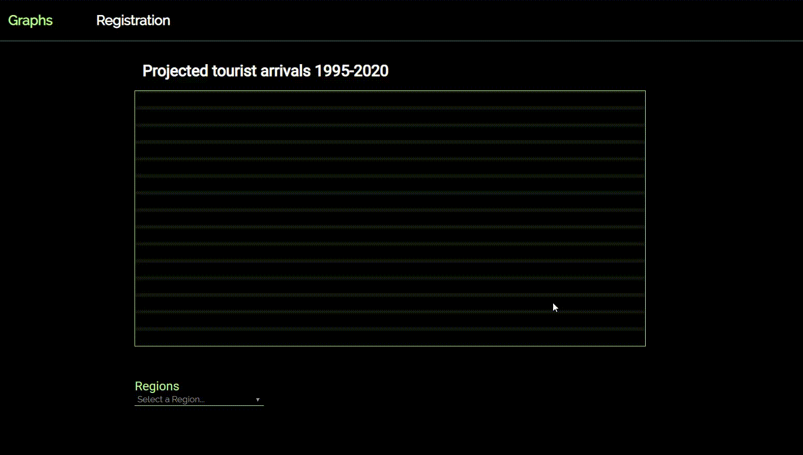

# Form Validation
This website incorporates form validation and populating data via JavaScript. Also demonstrates visualizing data by drawing graphs on HTML canvas.
[Demo of the website](http://svitlanalesiv.me/js_project/registration.html)

## Installation
* git clone https://github.com/svlesiv/form-validation.git
* navigate to `form-validation` directory
* open `registration.html` file in a browser